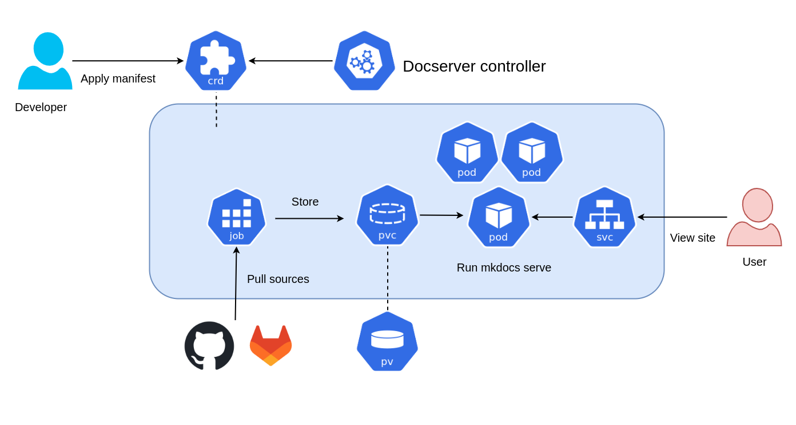

# Docserver-controller

Docserver-controller is a kubernetes custom controller to manage the CRD called docserver. This project is for users to deploy docserver-controller into your cluster.

The project has been developed with kubebuilder.


# Table of Contents

- [Description](#description)
- [Install](#install)
- [Usage](#usage)
  - [Prerequisites](#prerequisites)
  - [Deploying](#deploying)
- [Options](#options)
  - [Authentication](#authentication)
    - [Basic Authentication](#basic-authentication)
    - [Private repository using self-signed certificates.](#private-repository-using-self-signed-certificates)
    - [SSH private key](#ssh-private-key)
  - [Using custom image](#using-custom-image)
  - [PersistentVolumeClaim options](#persistentvolumeclaim-options)
- [Develop](#develop)
  - [Running on the cluster](#running-on-the-cluster)
  - [Uninstall CRDs](#uninstall-crds)
  - [Undeploy controller](#undeploy-controller)


# Description

In the project, the word "docserver" means a pod where [mkdocs](https://www.mkdocs.org/) is running. Docserver-controller manages the status of the Custom Resource Definitions (CRD) including docserver definition.

When users deploy CRD into the cluster, the following components are created and managed by the controller.

- `Gitpod` : A pod owned by Job. The main job is to pull the source of the documents from external git repository (github, gitlab or others) and store them into PersistentVolume.
- `Docserver` : A set of pods where mkdocs is running. The pods share the source of the documents in PersistentVolume.
- `PersistentVolumeClaim` : PersistentVolumeClaim used to store the source of the document that is shared by gitpod and docserver. This will be bound to a PersistentVolume created by user or dynamic provisioner.
- `Service` : A endpoint for user access to docserver.


The figure below shows the relations between the components.




# Install

You can install the docserver-controller with helm. The cert-manager have to be installed in your cluster before installing the project. See [Installation](https://cert-manager.io/docs/installation/) on the documentation to install the cert-manager.

Then clone this repository, move to project directory and run `helm install` to install the project from the local chart.

```
helm install docserver --namespace docserver ./charts/docserver/ --create-namespace
```


# Usage

## Prerequisites

A git repository that stores the source of the documents is required. The source will be built and published by mkdocs on the docserver pods.

The repository have to meet the followings.

- The mkdocs configuration (`mkdocs.yml`) is in the project top directory.
- The source are under in docs in the project top directory

The typical directory tree will be the following.

```
(project root)
├── mkdocs.yml
├── docs
│   ├── index.md
│   └── ...
└── (others)
```

The PersistentVolume also have to be created in the cluster so that PersistentVolumeClaim will be bound to it. This step can be skipped if PersistentVolume will be bound with dynamic provisioning.

You have to set the properties of PersistentVolume to meet the followings.

- `accessModes` : Set `ReadWriteMany`.
- `capacity.storage` : Equal or greater than `3Gi`.
- `storageClassName` : Set `default`.

``` yaml
# Example
kind: PersistentVolume
apiVersion: v1
metadata:
  name: mypv
spec:
  storageClassName: default
  capacity:
    storage: 10Gi
  accessModes:
  - ReadWriteMany
  hostPath:
    path: /data
```

## Deploying

To deploy docserver CRD in your cluster, create a CRD manifest. The following fields have to be set at least.

- apiVersion : Set `update.git-ogawa.github.io/v1beta1`.
- kind : Set `DocServer`.
- spec
    - target
        - url : URL of the git repository where the source of the documents will be pulled.
        - branch : Branch of the repository to be pulled. `main` by default.
    - replicas : The replica number of docserver pod.

Here is the example manifest in `config/samples/update_v1beta1_docserver.yaml`.

``` yaml
---
apiVersion: update.git-ogawa.github.io/v1beta1
kind: DocServer
metadata:
  name: sample
spec:
  target:
    url: https://github.com/git-ogawa/mkdocs-example.git
    branch: main
  replicas: 3
```

Run `kubectl apply -f config/samples/update_v1beta1_docserver.yaml` to deploy. The status of gitpod pod will be `Completed` and the docserver pods, persistentVolumeClaim and services are created.

```
$ kubectl get pod,svc,pvc
NAME                                                READY   STATUS      RESTARTS   AGE
pod/docserver-controller-manager-7c84b84c68-wxf69   2/2     Running     0          59m
pod/docserver-sample-78bc8559cf-k5xt7               1/1     Running     0          83s
pod/docserver-sample-78bc8559cf-knw9h               1/1     Running     0          83s
pod/docserver-sample-78bc8559cf-nh4kx               1/1     Running     0          83s
pod/gitpod-sample-dl587                             0/1     Completed   0          83s

NAME                                                   TYPE        CLUSTER-IP       EXTERNAL-IP   PORT(S)    AGE
service/docserver-controller-manager-metrics-service   ClusterIP   10.109.15.25     <none>        8443/TCP   59m
service/docserver-sample                               ClusterIP   10.102.119.207   <none>        8000/TCP   83s
service/docserver-webhook-service                      ClusterIP   10.110.230.81    <none>        443/TCP    59m

NAME                                     STATUS   VOLUME   CAPACITY   ACCESS MODES   STORAGECLASS   AGE
persistentvolumeclaim/docserver-sample   Bound    mypv     3Gi        RWX            default        60s
```

You can access docserver pods through service port 8000.

```
$ kubectl port-forward svc/docserver-example 8000:8000
Forwarding from 127.0.0.1:8000 -> 8000
Forwarding from [::1]:8000 -> 8000

# Check if the server is running in another console
$ curl 0.0.0.0:8000 -I
HTTP/1.0 200 OK
Date: Wed, 21 Jun 2023 12:44:40 GMT
Server: WSGIServer/0.2 CPython/3.11.4
Content-Type: text/html
Content-Length: 9345
```

# Options

## Authentication

When user pull the source from repositories that authentication is required, additional options must be set in the manifest. DocServer CRD provides some options about the authentication.


### Basic Authentication

If basic authentication is required when access to repositories, at first user have to create a secret including username and password.

``` yaml
apiVersion: v1
kind: Secret
metadata:
  name: [your_secretname]
type: kubernetes.io/basic-auth
stringData:
  username: [your_username]
  password: [your_password]
```

Once the secret is created, make CRD manifest that set the name of the secret in `.spec.target.basicAuthSecret`.


``` yaml
spec:
  target:
    ...
    basicAuthSecret: [your_secret_name]
```


### Private repository using self-signed certificates.


If the source of the documents is managed in the repository using self-signed certificates or custom certificates authority, the docserver provides two options.


The first is to set `.spec.target.sslVerify: false` not to check server identity.

``` yaml
spec:
  target:
    ...
    sslVerify: false
```

The second is to configure manifest to trust your certificate. Save the CA certificate used by the repository as `ca.crt` and create kubernetes secret by the following commands.

```
kubectl create secret generic [secret_name] --from-file=ca.crt
```

Then set the secret to `spec.target.tlsSecret`.

``` yaml
spec:
  target:
    ...
    tlsSecret: [secret_name]
```

### SSH private key

If you want to pull the source with ssh protocol, you need to prepare ssh configuration.

To use ssh protocol when pulling the source, create configmap to set configuration used ssh clone.

``` yaml
apiVersion: v1
kind: ConfigMap
metadata:
  name: [your_config_name]
data:
  config: |
    Host my.git.server
      HostName 192.168.3.2
      User git
      Port 22
      IdentityFile ~/.ssh/id_rsa
```

The content above corresponds to the following `~/.ssh/config`.

```
Host my.git.server
  HostName 192.168.3.2
  User git
  Port 22
  IdentityFile ~/.ssh/id_rsa
```

Then create kubernetes secret to store ssh private-key. Replace key filename if you use other ssh key type.

```
kubectl create secret generic [your_secret_name] --from-file=id.rsa
```

Finally, set the configmap and secret to `sepc.target.sshSecret.config` and `sepc.target.sshSecret.config`.

``` yaml
spec:
  target:
    ...
    sshSecret:
      config: [your_config_name]
      privatekey: [your_secret_name]
```


## Using custom image

The image used by docserver pod by default is [squidfunk/mkdocs-material](https://hub.docker.com/r/squidfunk/mkdocs-material). If you want to use other image, you can build your own image and use it. The image have to meet the following condition.

- WORKDIR is `/docs`.
- ENTRYPOINT is `mkdocs`.
- The arguments of CMD include `serve`.

The example Dockerfile that install additional plantuml package is the following.

``` Dockerfile
From python:3.11-slim-bookworm

RUN pip install --no-cache-dir \
    mkdocs \
    mkdocs-material \
    plantuml-markdown

RUN mkdir /docs
WORKDIR /docs

ENTRYPOINT ["mkdocs"]
CMD ["serve", "--dev-addr=0.0.0.0:8000"]
```

Once build your image, you can use it as docserver image by setting the name to `.spec.image` in a manifest.

``` yaml
spec:
  ...
  image: [your_image]
```


## PersistentVolumeClaim options

Docserver controller creates PersistentVolumeClaim to store the sources of the document when docserver CRD is created in the cluster. The request size is `3Gi` and storageClassName is `default` by default. You can change the size and storageClassName by settings the values in a manifest.
YOu have to set correct storageClass supported by provisioner if you want to use dynamic volume provisioning.

``` yaml
spec:
  ...
  storage:
    size: 5Gi
    storageClass: myclass
```


# Develop

This section is for developer.


You’ll need a Kubernetes cluster to run against. You can use [KIND](https://sigs.k8s.io/kind) to get a local cluster for testing, or run against a remote cluster.
**Note:** Your controller will automatically use the current context in your kubeconfig file (i.e. whatever cluster `kubectl cluster-info` shows).

## Running on the cluster
1. Install Instances of Custom Resources:

```sh
kubectl apply -f config/samples/
```

2. Build and push your image to the location specified by `IMG`:

```sh
make docker-build docker-push IMG=<some-registry>/docserver:tag
```

3. Deploy the controller to the cluster with the image specified by `IMG`:

```sh
make deploy IMG=<some-registry>/docserver:tag
```

## Uninstall CRDs
To delete the CRDs from the cluster:

```sh
make uninstall
```

## Undeploy controller
UnDeploy the controller from the cluster:

```sh
make undeploy
```
